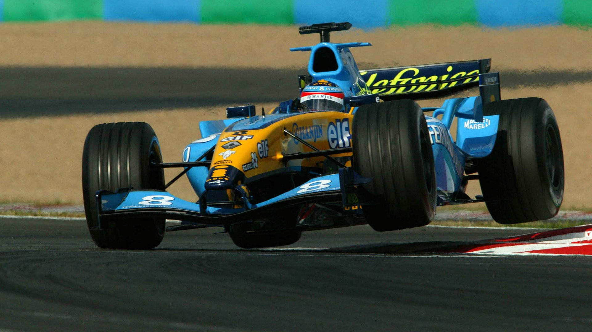

# *Fernando Alonso*

¿Quién es?

Nacido en 1981 en Oviedo, Asturias; es un piloto de carreras español, galardonado como Premio Príncipe de Asturias en 2005. Ha ganado dos veces el Campeonato Mundial de Fórmula 1 en 2005 y 2006, resultó subcampeón en 2010, 2012 y 2013, y obtuvo un tercer puesto en 2007. Fue campeón del Campeonato Mundial de Resistencia de la FIA en 2019, las 24 Horas de Le Mans en 2018 y 2019, las 24 Horas de Daytona de 2019 y el Campeonato Mundial de Karting en 1996.

¿Qué ha hecho en F1

## *Fórmula 1*

Su trayectoria profesional ha estado marcada por los dos campeonatos del mundo que cosechó con Renault y por las batallas que ha labrado en inferioridad de condiciones. Su capacidad para rendir por encima del nivel del monoplaza le distingue de la mayoría de sus competidores.

En su carrera ha competido para los equipos Minardi, Renault, McLaren, Ferrari, Alpine y Aston Martin, siendo la escudería de Maranello su equipo desde 2010 hasta 2014, donde logró sus tres subcampeonatos y su único Grand Chelem.

Se marchó de Ferrari y en 2015 volvió a McLaren con su motor Honda hasta la retirada de 2018. Tras dos años fuera de la categoría, en 2021 volvió con la escudería Alpine, parte de la familia Renault, con la que ganó sus dos campeonatos. Desde 2023 forma parte del equipo Aston Martin sustituyendo a Sebastian Vettel.

### *Victorias en Fórmula 1*

- Renault: 17 victorias
- Mclaren: 4 victorias
- Ferrari: 11 victorias

#### *Podios en Fórmula 1*

| Escuderías | Podios | 
| --------- | --------- | 
| Renault (2003-2006) | 37 | 
| Mclaren (2007) | 12 | 
| Renault (2008-2009)| 4 | 
| Ferrari (2010-2014) | 44| 
| Alpine (2021) | 1 |
| Aston Martin (En disputa) | 2 |

Después de su tercer lugar en el GP de Arabia Saudita, llegó a los 100 podios. Con esta cifra se vuelve el sexto piloto en la historia de la categoría en llegar a esa cantidad de podios

#### *Crashgate: su victoria más controversial*

Fue un escándalo deportivo protagonizado por el equipo Renault F1 Team en la Fórmula 1 en 2008. Nelson Piquet, Jr., por entonces piloto de Renault, acusó a su ingeniero de ordenarle provocar un accidente durante el Gran Premio de Singapur 2008 para conseguir ventaja deportiva para su compañero de equipo Fernando Alonso.

El 28 de septiembre de aquel año, durante la vuelta 13, el monoplaza conducido por Piquet se estrelló contra el muro del circuito en la curva 17. El accidente hizo necesaria la salida del auto de seguridad. Fernando Alonso, que en ese momento era decimoquinto clasificado, acabó ganando la carrera debido a la aparición del coche de seguridad.

##### *Enlace para video sobre crashgate*

[Clic aquí](https://www.youtube.com/watch?v=zCjJgCwm4Kg)
